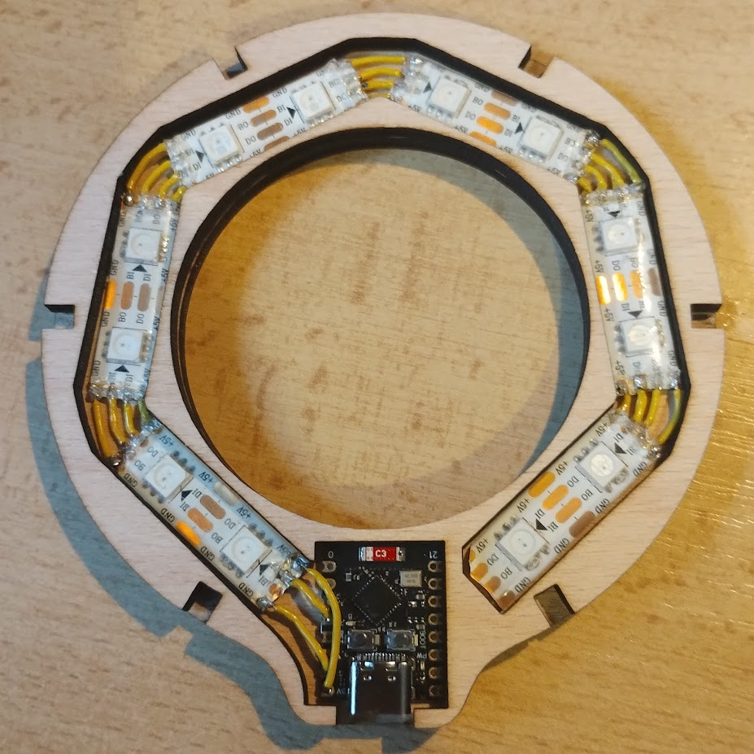
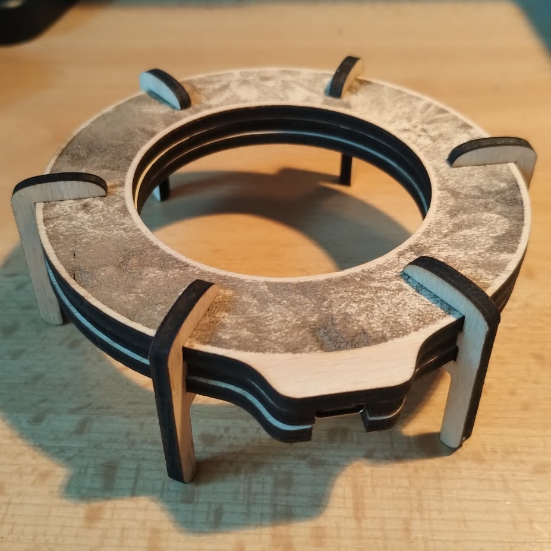
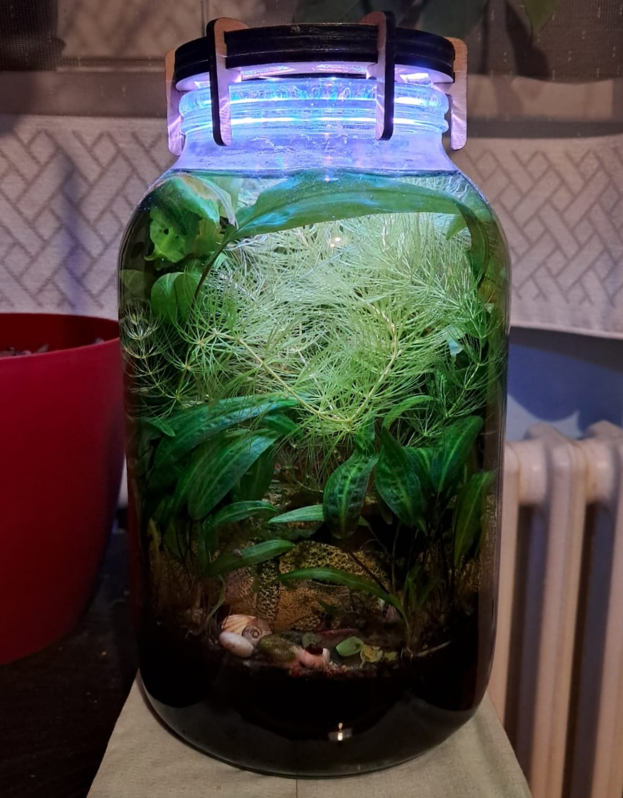

# Plywood jarrarium lamp

This repository contains files related to a DIY LED light for my [Jarrarium](https://www.reddit.com/r/Jarrariums/).

Written in [Rust](https://www.rust-lang.org/tools/install), powered by [Embassy](https://github.com/embassy-rs/embassy).





The light is composed of the ESP32-C3 SuperMini board, which controls a WS2813 LED strip. The case for the light should be cut out of 4mm plywood. The [plywood_lamp.dxf](cad/plywood_lamp.dxf) file is ready for laser cutting. 

## Building

### Prerequisites

- [Rust](https://www.rust-lang.org/tools/install)
- [espflash](https://github.com/esp-rs/espflash/tree/main/espflash)

### Build & flash

Set the SSID and PASSWORD variables in [lamp-esp32/.cargo/config.toml](lamp-esp32/.cargo/config.toml).
With those set, and with the ESP board connected via a USB cable, you can now run the following command to flash the board: 

```bash
cd lamp-esp32
cargo run --release
```

## Controlling

Once the light connects to wifi, it can be controlled via HTTP POST requests. For the appropriate format, refer to the [control_scripts](control_scripts).

### License
[MIT](LICENSE)